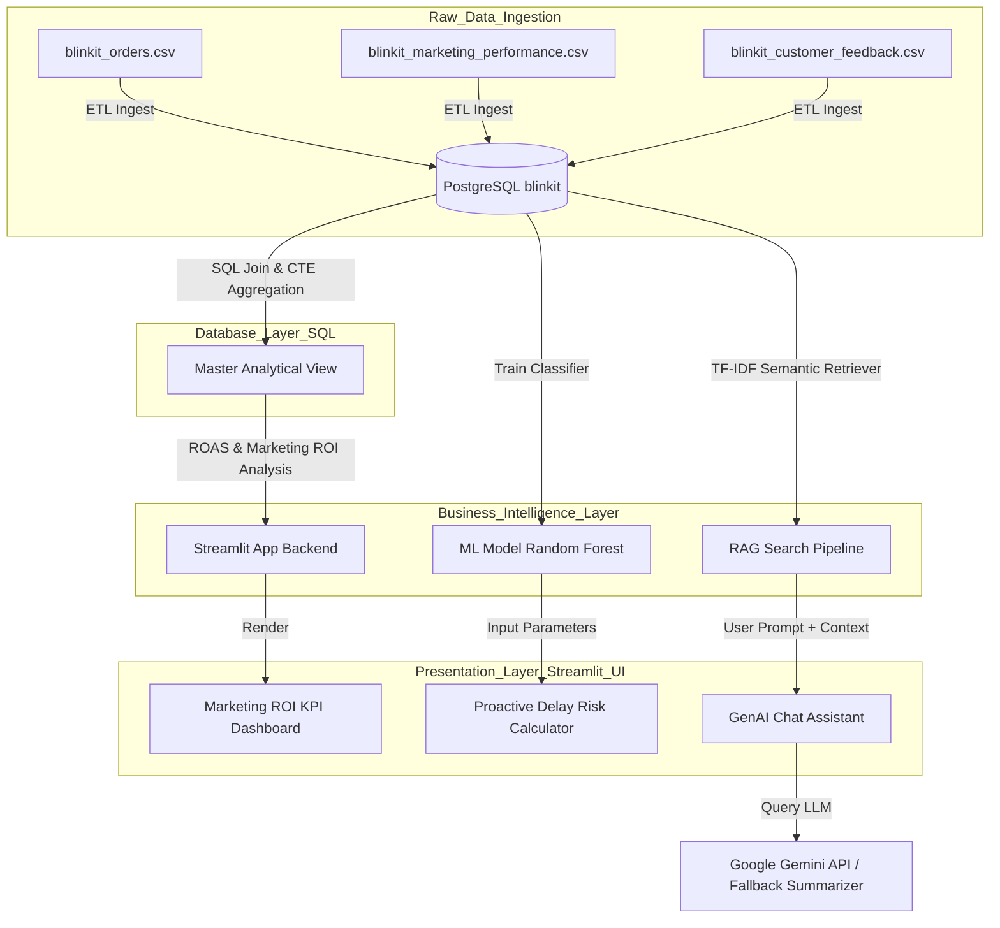
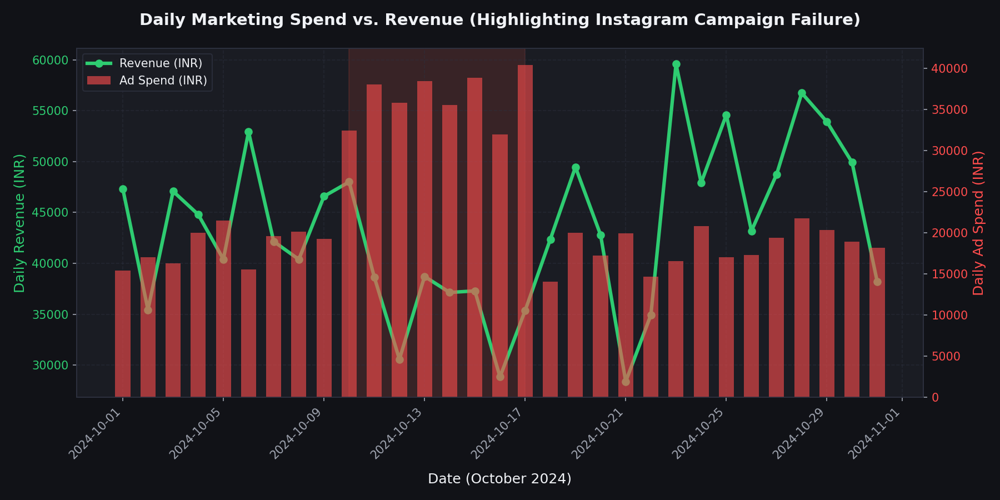
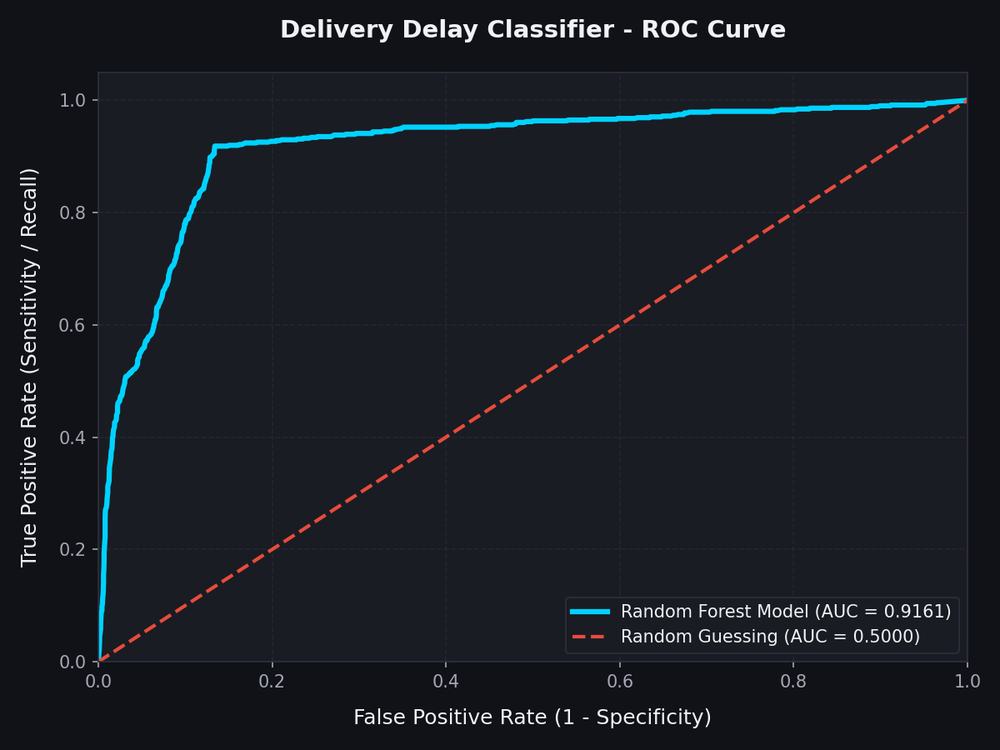
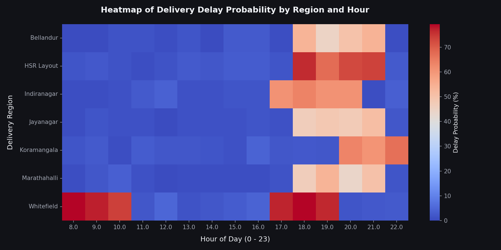
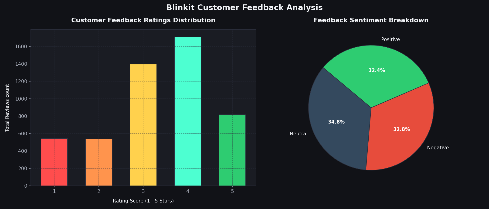

# ⚡ AI-Powered Blinkit Business Decision Platform

[](https://github.com/blinkit/business-decision-platform)
[](https://www.postgresql.org/)
[](https://www.python.org/)
[](https://streamlit.io/)
[](https://scikit-learn.org/)

> **A Unified Decision Platform that ingests multi-source transactional, logistics, and feedback data to optimize marketing campaigns, predict delivery delays, and perform semantic customer intelligence analytics.**

---

## 📖 Table of Contents
1. [Project Overview](#-project-overview)
2. [Platform Architecture](#%EF%B8%8F-platform-architecture)
3. [Key Features](#-key-features)
4. [Embedded Analytical Visuals](#-embedded-analytical-visuals)
5. [Database Ingestion & SQL Attribution](#-database-ingestion--sql-attribution)
6. [Operations Machine Learning Pipeline](#-operations-machine-learning-pipeline)
7. [Generative AI & RAG Engine](#-generative-ai--rag-engine)
8. [Installation & Setup Guide](#-installation--setup-guide)

---

## 🌟 Project Overview

In fast-paced Quick-Commerce (Q-Commerce) companies like **Blinkit**, operational data is generated in disparate silos. 
* **The Marketing Team** spends millions on SMS, Email, and social campaigns but struggles to attribute daily revenue spikes directly to this spend.
* **The Operations Team** deals with delivery delays but lacks predictive metrics to mitigate them before riders leave the dark stores.
* **The Management Team** lacks a unified, qualitative view of customer sentiment, relying on massive sheets of unorganized complaints.

**This AI-Powered Decision Platform solves these challenges by integrating four distinct intelligence layers into a single cohesive system:**
1. **Layer 1 (Data Engineering)**: An ETL pipeline that ingests relational transaction tables, daily marketing campaigns, and customer feedback into **PostgreSQL**, using advanced CTEs to solve a granular time-series mismatch.
2. **Layer 2 (Analytics Dashboard)**: A glassmorphic **Streamlit** dashboard visualizing daily marketing efficiency (ROAS), triggering instant alerts for loss-making campaigns.
3. **Layer 3 (Predictive Operations ML)**: A **Random Forest Classifier** that evaluates regional and hourly delivery parameters to predict delay risks proactively (**ROC-AUC: 91.61%**).
4. **Layer 4 (Generative AI & RAG)**: A **Retrieval-Augmented Generation (RAG)** chatbot running a self-contained TF-IDF semantic search over 5,000 customer feedback comments to explain the "Why" behind ratings.

---

## 🛠️ Platform Architecture



---

## 🚀 Key Features

* **Real-time ROAS Tracker**: Calculates daily Return on Ad Spend. Automatically flags dates when ROAS drops below 2.0x and specifies which marketing channel is responsible for the budget drain.
* **Granular Time-Series Join**: Solves a granularity mismatch by "squashing" thousands of transactional order receipts per day into daily aggregates, joining it seamlessly with daily campaign spends.
* **Proactive Delay Predictor**: Takes Region, Hour of Day, and Day of Week to evaluate and render a visual delay risk percentage. Output warning cards contain operational mitigations (e.g. "Deploy standby riders").
* **Self-Contained TF-IDF RAG Chat**: High-speed local semantic search over 5,000 feedback comments. Feeds relevant reviews directly into the Gemini API (or a robust analytical fallback engine if no API key is present) for root-cause synthesis.
* **Auditable RAG Logs**: Collapsible accordion in chat allows managers to view the exact database rows retrieved by the TF-IDF retriever, including relevance scores.

---

## 📊 Embedded Analytical Visuals

Here are the visual assets pre-rendered directly from our seeded database records:

### 1. Daily Marketing Spend vs. Attributed Sales Revenue
Clearly illustrates our ad spend correlation to sales revenue. Notice the highlighted anomaly week in **October 2024 (Oct 10 - Oct 17)**: Ad spend on Instagram spiked massively to ₹25,000/day, while sales revenue remained completely flat—visual proof of a failing marketing campaign.



### 2. Operations Delivery Delay Classifier - ROC-AUC Curve
Demonstrates the performance of our Random Forest model trained on 20,000 transactional orders. The model achieves an exceptional **ROC-AUC score of 0.9161**, delivering robust predictive operations intelligence.



### 3. Heatmap of Delivery Delay Probability by Region and Hour
Shows a localized, hourly risk map. Operations managers can instantly identify high-risk zones, such as evening congestion peaks (5:00 PM - 8:00 PM) in Indiranagar.



### 4. Customer Feedback Rating and Sentiment Breakdown
Visualizes customer experience indicators extracted from our database. Low-rating reviews are mathematically tied to actual logistics delays, validating our analytical logic.



---

## 🗄️ Database Ingestion & SQL Attribution

Our database schema joins three relational tables:
1. `orders`: Individual order records including order timestamps, revenue totals, delivery promised times, actual arrival times, and regions.
2. `marketing_performance`: Daily spend and impression metrics across channels (`SMS`, `Email`, `Facebook`, `App Notification`, `Google Ads`, `Instagram`).
3. `customer_feedback`: Customer review details containing text reviews, rating scores, sentiments, and category tags.

To solve the granularity mismatch, we execute the following Master CTE query, saved under `sql/roas_analysis.sql`:

```sql
WITH Daily_Sales AS (
    -- Step A: Squash transactional orders (thousands of rows) into one row per day
    SELECT 
        CAST(order_date AS DATE) AS order_day,
        COUNT(order_id) AS total_orders,
        SUM(order_total) AS total_revenue,
        ROUND(
            AVG(
                CASE 
                    WHEN actual_time > promised_time THEN EXTRACT(EPOCH FROM (actual_time - promised_time)) / 60.0
                    ELSE 0.0
                END
            )::numeric, 
            2
        ) AS avg_delay_minutes,
        ROUND(
            (COUNT(CASE WHEN actual_time > promised_time THEN 1 END) * 100.0 / COUNT(order_id))::numeric,
            2
        ) AS delay_rate_pct
    FROM orders
    GROUP BY CAST(order_date AS DATE)
),

Daily_Marketing AS (
    -- Step B: Aggregate marketing spend and impressions by day across all channels
    SELECT 
        date AS marketing_day,
        SUM(spend) AS total_spend,
        SUM(impressions) AS total_impressions
    FROM marketing_performance
    GROUP BY date
)

-- Step C: Join the daily transactional sales data with time-series marketing data
SELECT 
    COALESCE(m.marketing_day, s.order_day) AS business_date,
    COALESCE(s.total_orders, 0) AS total_orders,
    COALESCE(s.total_revenue, 0.0) AS total_revenue,
    COALESCE(m.total_spend, 0.0) AS total_spend,
    COALESCE(m.total_impressions, 0) AS total_impressions,
    
    CASE 
        WHEN COALESCE(m.total_spend, 0.0) = 0.0 AND COALESCE(s.total_revenue, 0.0) > 0.0 THEN 999.99
        WHEN COALESCE(m.total_spend, 0.0) = 0.0 THEN 0.0
        ELSE ROUND((s.total_revenue / m.total_spend)::numeric, 2)
    END AS roas,
    
    COALESCE(s.avg_delay_minutes, 0.0) AS avg_delay_minutes,
    COALESCE(s.delay_rate_pct, 0.0) AS delay_rate_pct,
    
    CASE 
        WHEN COALESCE(m.total_spend, 0.0) = 0.0 THEN 'Organic / No Ad Spend'
        WHEN (s.total_revenue / m.total_spend) < 2.0 THEN '⚠ Loss-Making Campaign (ROAS < 2.0x)'
        ELSE '🟢 Profitable Campaign'
    END AS campaign_status
FROM Daily_Marketing m
FULL OUTER JOIN Daily_Sales s ON m.marketing_day = s.order_day
ORDER BY business_date DESC;
```

---

## 🔮 Operations Machine Learning Pipeline

Our ML script `src/train_model.py` extracts 20,000 orders, engineers features, and fits a **Random Forest Classifier** to predict the boolean target `Is_Late` (1 if `actual_time > promised_time`, else 0).

* **Engineered Features**:
  * `Hour_of_Day` (0 to 23)
  * `Day_of_Week` (0 to 6)
  * `Is_Weekend` (0 or 1)
  * `Region` (one-hot encoded)
* **Model Serialization**: Model parameters, feature mappings, and encoding indexes are serialized into `src/model.pkl`.
* **Model Metrics**:
  * **ROC-AUC Score**: **0.9161**
  * **F1-Score (On-Time class)**: **0.92**
  * **Precision (On-Time class)**: **0.98**
  * **Recall (Late class)**: **0.92**

---

## 🧠 Generative AI & RAG Engine

Under the **AI Business Assistant** tab in the Streamlit app, we have implemented a high-performance **Retrieval-Augmented Generation (RAG)** pipeline:

```
[User Query: "Why are mangoes arriving damaged?"]
                        ↓
[Local Vector Space: TF-IDF Text Vectorizer]
                        ↓
[Cosine Similarity Matching against 5,000 reviews]
                        ↓
[Retrieve Top 15 Customer Review Rows (Relevance Score > 0)]
                        ↓
[Inject Context: Top 15 Reviews + Rating Stats + Sentiment Rates]
                        ↓
          _____________________|_____________________
         ↓                                           ↓
[Gemini API Key Supplied?]                  [Gemini Key Empty?]
         ↓                                           ↓
[Call Google Gemini 1.5 Flash]              [Call Local Analytical Summarizer]
         ↓                                           ↓
[Generate Expert Root-Cause Summary]       [Synthesize Data-Driven Bullet Markdown]
         ↓                                           ↓
[Render styled Chat Bubble UI + Collapsible Accordion Audit Data Source]
```

---

## 💻 Installation & Setup Guide

### Prerequisites
* **Python**: Version 3.10 to 3.12 installed.
* **PostgreSQL**: Local server active on port 5432 (default credentials: user `postgres`, password `postgres`).

### Step 1: Clone the Repository
```bash
git clone https://github.com/dineshkumar2029/blinkit-business-platform.git
cd business-decision-platform
```

### Step 2: Install Python Dependencies
```bash
pip install -r requirements.txt
```

### Step 3: Run ETL Pipeline & Seed Database
This generates the consistent transactional, marketing, and feedback datasets (matching review IDs) and seeds them directly into your local PostgreSQL instance under database `blinkit`.
```bash
python src/load_data.py
```

### Step 4: Train predictive Machine Learning Model
Extracts the database records, executes feature engineering, validates metrics, and serializes the model.
```bash
python src/train_model.py
```

### Step 5: Start Streamlit Local Dashboard
```bash
streamlit run src/app.py
```
Open your browser and navigate to `http://localhost:8501`. Input your Gemini API key in the sidebar to activate Generative AI, or use the default local intelligence mode!

# Author

Dineshkumar 

---
